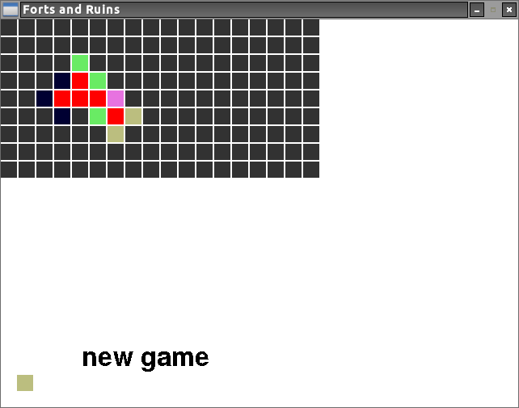

##Forts and Ruins

Forts and Ruins started as a game played with graph paper and dice, with simple-ish rules:

1. The game starts with a single **fort** placed somewhere on the board.
2. Nikolai (the player) places a **territory** with a value between 1 and 6 in one of the 8 cells adjacent to the fort.
3. The board is evaluated:
 1. All empty cells that are surrounded on each of the four walls by either a living fort or a living territory are replaced with a fort. If one of the walls is empty or dead, then the cell remains empty.
 2. A 6-sided dice is rolled. All territories with the correspinding value are killed.
 3. All forts that are not connected to a territory through living cells are killed. A dead fort is called a **ruin**.
 4. All territories that are not connected to a fort through living cells are killed.
4. Main loop begins with Nikolai placing a territory and the board being evaluated. The game stops when there are no living forts so Nikolai can not make a move.

Note that exactly the above steps occur in the `updatefield` function in `updatefield.py`.

Nikolai can justify the above rules by thinking of forts as villages and territories as farms, both with roads running through them. If a village has no access to food, it will die. If a farm has no one running it, or there is bad weather, it will die. If there is a lot of food being produced in an area, then people will move in.

###How to run the code
First you need to [install pygame](http://www.pygame.org/download.shtml).
Then run `python gui.py` in your terminal.
A window will pop up where you can play the game.

* `1`, `2`, `3`, `4`, `5`, and `6` make the next box you click that color.
* click to place a territory
* `q` resets the board
* left and right arrows move backward or forward a step in time when you are in replay mode

###Thanks
Thanks to Max Williams who invented the game on paper, and was a key part of beginning development. He has made his own complete version, but I am not sure where you can find it.
